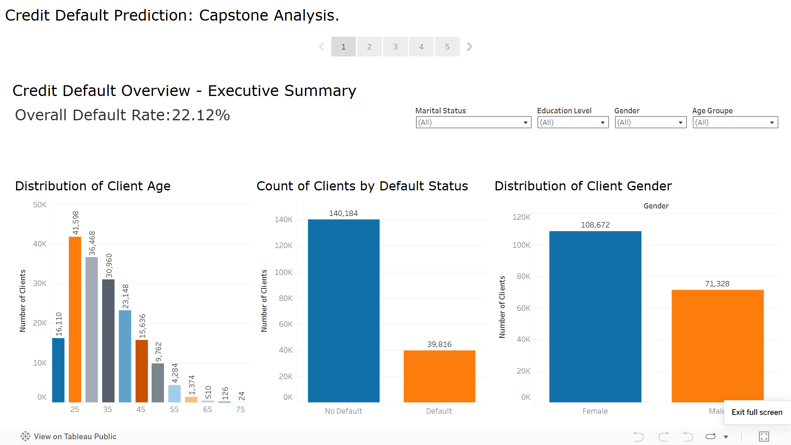
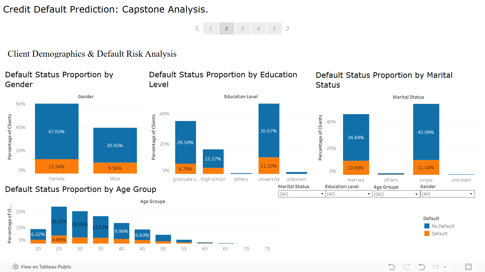
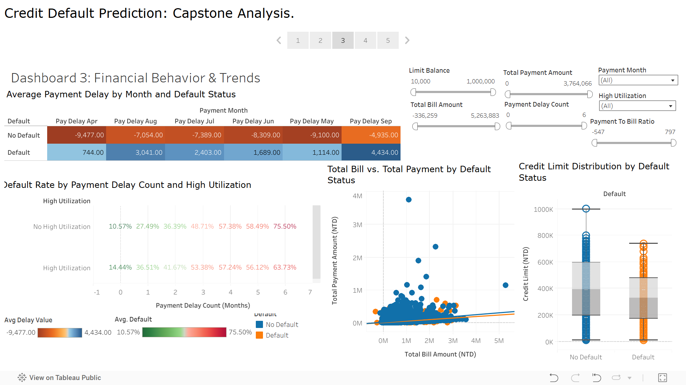
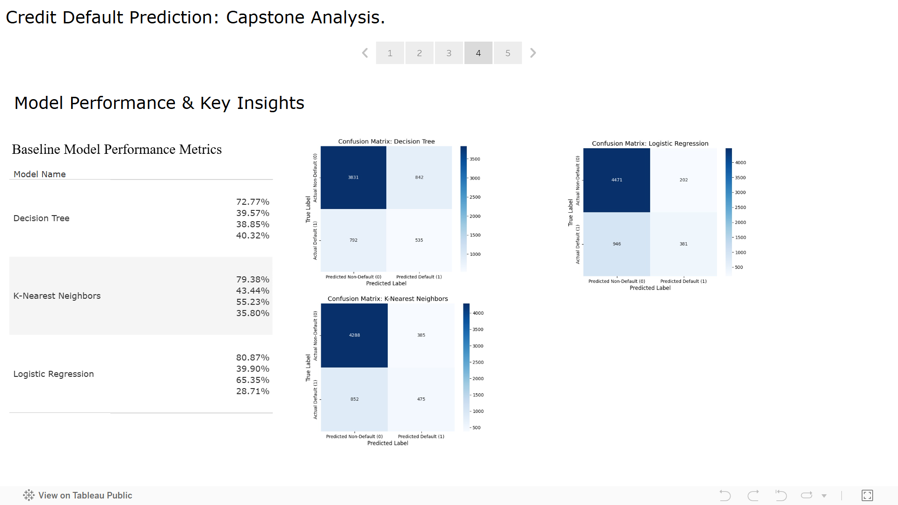

# Credit Risk Prediction

This project aims to analyze and predict credit card default risk to help financial institutions make informed decisions, minimize losses, and improve customer strategies.

## Table of Contents

1. [Project Overview](#project-overview)
2. [Dataset Content](#dataset-content)
3. [Business Requirements](#business-requirements)
4. [Hypotheses and Validation](#hypotheses-and-validation)
5. [Project Plan](#project-plan)
6. [The rationale to map the business requirements to the Data Visualisations](#the-rationale-to-map-the-business-requirements-to-the-data-visualisations)
7. [Analysis techniques used](#analysis-techniques-used)
8. [Ethical considerations](#ethical-considerations)
9. [Dashboard Design](#dashboard-design)
10. [Unfixed Bugs](#unfixed-bugs)
11. [Development Roadmap](#development-roadmap)
12. [Deployment](#deployment)
13. [Main Data Analysis Libraries](#main-data-analysis-libraries)
14. [Credits](#credits)
15. [Acknowledgements (optional)](#acknowledgements-optional)

---

## Key Resources:

- **Dataset**: [https://www.kaggle.com/datasets/uciml/default-of-credit-card-clients-dataset](https://www.kaggle.com/datasets/uciml/default-of-credit-card-clients-dataset)
- **GitHub Repository**: [https://github.com/bitandrei/Credit-Risk-Prediction](https://github.com/bitandrei/Credit-Risk-Prediction)
- **Tableau Dashboard**: [https://public.tableau.com/views/Credit_Default_Capstone_Dashboard/CreditDefaultPredictionCapstoneAnalysis?:language=en-GB&publish=yes&:sid=&:redirect=auth&:display_count=n&:origin=viz_share_link](https://public.tableau.com/views/Credit_Default_Capstone_Dashboard/CreditDefaultPredictionCapstoneAnalysis?:language=en-GB&publish=yes&:sid=&:redirect=auth&:display_count=n&:origin=viz_share_link)

---

## Who is this project for?

This report is designed for both technical and non-technical audiences — especially decision-makers in banking or risk teams who want to understand which customers are most at risk and how data can help reduce defaults.

## Project Overview

This capstone project focuses on building a robust data analytics solution to predict credit card default. By leveraging historical customer data, we aim to identify key risk factors and develop predictive models that can flag potential defaulters. The ultimate goal is to empower financial institutions with data-driven insights to minimize financial losses and optimize their lending practices.

## Dataset Content

The dataset contains comprehensive information on credit card clients in Taiwan, covering their payment behavior, demographic data, credit limits, and past bill statements. Each row represents a client, and the columns include:

- **Demographic Information:** Gender, Education Level, Marital Status, Age.
- **Financial Information:** Credit Limit, Bill Amounts for the past six months, Payment Amounts for the past six months.
- **Payment History:** Records of Payment Delays for the past six months (e.g., paid on time, delayed by one month, etc.).
- **Target Variable:** `Default` (whether the client defaulted on their next payment, 1 for default, 0 for no default).

## Business Requirements

The core business goal is to reduce financial losses due to credit card defaults. To achieve this, the project addresses several key business questions:

- **Which features most influence credit default?** We aim to uncover the most significant factors, especially those related to financial behavior and payment history.
- **What customer groups are most at risk?** Identifying specific demographic segments or behavioral patterns that correlate with higher default rates.
- **Can we predict default risk with a model?** Developing and evaluating machine learning models to accurately forecast which clients are likely to default.

By answering these questions, financial institutions can implement targeted risk mitigation strategies, improve customer segmentation, and make more precise lending decisions.

## Hypotheses and Validation

Our analysis was guided by several hypotheses, which were checked using statistical and machine learning methods:

- **Hypothesis 1: Payment behavior (e.g., consistent delays) significantly influences credit default.**
  - **How we checked it:** Explored through descriptive statistics, correlation analysis, and feature importance derived from machine learning models. Visualized using heatmaps and highlight tables.
- **Hypothesis 2: Demographic factors (Gender, Education, Marital Status, Age) are associated with credit default.**
  - **How we checked it:** Tested using statistical methods like Chi-Square tests (for categorical variables like Gender, Education, Marriage) and Mann-Whitney U tests (a non-parametric alternative to t-tests for continuous variables like Age) to determine if there are statistically significant differences between defaulters and non-defaulters. Visualized using stacked bar charts and box plots.
- **Hypothesis 3: Machine learning models can effectively predict credit default risk.**
  - **How we checked it:** We trained and evaluated various classification models and compared their accuracy using real data.

## Project Plan

The project followed a structured data analytics pipeline:

1.  **Extract, Transform, Load (ETL):** Data loading, cleaning (handling missing values, correcting data types), and initial preparation.
2.  **Exploratory Data Analysis (EDA):** Understanding the dataset's characteristics, distributions, and initial relationships between variables.
3.  **Statistical Analysis:** Formal hypothesis testing to validate assumptions about feature relationships with default.
4.  **Feature Engineering:** Creating new, more insightful features from existing data (e.g., `Total Bill Amount`, `Payment to Bill Ratio`, `Payment Delay Count`, `High Utilization`).
5.  **Machine Learning (ML):** Training and evaluating baseline predictive models.
6.  **Dashboarding:** Creating interactive visualizations in Tableau to present insights and model performance.
7.  **Conclusions & Recommendations:** Summarizing key findings and providing actionable business recommendations.

## The Rationale to Map the Business Requirements to the Data Visualisations

Each dashboard and its visuals were designed to directly address the business requirements:

- **Dashboard 1: Executive Summary / Overall Default Overview:**

  - **Purpose:** Provides a high-level snapshot of the problem.
  - **Visuals:** A large **KPI** shows the overall default rate (e.g., 22.1%), immediately answering "What is the scale of the problem?". Simple **bar charts** show overall client counts by gender and age, giving a quick demographic overview.
    

- **Dashboard 2: Demographics & Default Risk:**

  - **Purpose:** Explores if certain customer groups are more at risk based on demographics.
  - **Visuals:** **100% Stacked Bar Charts** for Gender, Education, and Marital Status clearly show the _proportion_ of defaulters within each category, directly addressing "What customer groups are most at risk?" based on these factors. A similar stacked bar chart for **Age Groups** provides age-related risk insights.
    

- **Dashboard 3: Financial Behavior & Payment Trends:**

  - **Purpose:** Deep dives into financial factors that influence default.
  - **Visuals:** A **Heatmap** visualizes average payment delays across months for defaulters vs. non-defaulters, quickly highlighting problematic periods. A **Scatter Plot** compares total bill vs. total payment, revealing patterns in financial activity. A **Box Plot** shows the distribution of credit limits for defaulters vs. non-defaulters. A **Highlight Table** combines payment delay count and high utilization to pinpoint the riskiest client segments, directly answering "Which features most influence credit default?" from a behavioral standpoint.
    

- **Dashboard 4: Model Performance & Key Insights:**
  - **Purpose:** Presents the predictive capabilities and model performance.
  - **Visuals:** A clear **table** summarizes key machine learning metrics (Accuracy, Precision, Recall, F1-Score) for each model, addressing "Can we predict default risk with a model?". **Confusion Matrix images** provide a detailed breakdown of True Positives, False Negatives, etc., for each model, offering transparent insights into their strengths and weaknesses.
    

## Analysis Techniques Used

This project utilized a blend of programming, statistical, and visualization techniques:

- **Python:** The primary language for data manipulation, analysis, and machine learning.
  - **Descriptive Statistics:** Used to understand data distributions, central tendencies, and variability.
  - **Feature Engineering:** Creation of new, more predictive variables (e.g., `Total Payment Amount`, `Payment Delay Count`).
  - **Statistical Hypothesis Testing:** Chi-Square and Mann-Whitney U tests were employed to formally assess relationships between variables.
  - **Machine Learning Models:** Logistic Regression, Decision Tree, and K-Nearest Neighbors were trained and evaluated for credit default prediction. These models are used to classify whether a customer might default based on their characteristics.
- **Tableau:** Used for creating interactive and insightful dashboards.
  - **Interactive Visualizations:** Bar charts, stacked bar charts, histograms, scatter plots, box plots, heatmaps, and highlight tables.
  - **Filters and Parameters:** Enabled dynamic exploration of the data by users.
  - **Color Coding:** Consistent and colorblind-friendly palettes were used to enhance readability and highlight key distinctions (e.g., Defaulters vs. Non-Defaulters).

## Ethical Considerations

In developing this credit risk prediction solution, ethical considerations were paramount:

- **Fairness and Bias:** We acknowledge that historical data can contain biases. While direct demographic features like Gender and Age were included for analysis, careful consideration was given to their interpretation to avoid perpetuating discriminatory practices. The models are intended to identify risk based on financial behavior, not to unfairly penalize specific groups.
- **Data Privacy:** The dataset used is anonymized. In a real-world scenario, strict adherence to data privacy regulations (e.g., GDPR, CCPA) would be essential, ensuring client data is protected and used only for its intended purpose.
- **Responsible AI/ML:** The predictive models are tools to assist decision-making, not replace human judgment. Their output should be used as one factor among many in a comprehensive credit assessment, allowing for human oversight and the consideration of individual circumstances. Transparency in model performance (via confusion matrices and metrics) is crucial.

## Dashboard Design

The Tableau dashboards were designed with user experience and clear communication in mind:

- **Intuitive Layout:** Information flows logically from high-level summaries to detailed analyses.
- **Consistent Color Coding:** A consistent, colorblind-friendly palette (e.g., blue for "No Default," orange for "Default") is used across all relevant charts, making it easy to distinguish between groups at a glance.
- **Interactive Filters:** Filters for key dimensions (e.g., Age Group, Education, Marital Status, Credit Limit, Payment Delays) allow users to explore specific segments of the data and uncover tailored insights.
- **Diverse Chart Types:** A variety of chart types were chosen to best represent different data relationships:
  - **KPIs:** For immediate understanding of key metrics.
  - **Bar Charts / Stacked Bar Charts:** For comparing counts and proportions across categories.
  - **Histograms:** For visualizing the distribution of continuous data like Age.
  - **Heatmaps:** To show patterns and relationships across multiple categorical variables and time.
  - **Scatter Plots:** To explore relationships between two continuous variables for individual clients.
  - **Box Plots:** To compare the statistical distribution (median, spread, outliers) of continuous variables across groups.
  - **Highlight Tables:** To show average metrics across combinations of categories, with color highlighting risk levels.

## Unfixed Bugs

- Currently, the confusion matrix images are embedded statically on the dashboard. While highly reliable, this means they are not dynamically updated via a parameter selection, which was an initial goal. This is a known limitation when working with local image paths in Tableau Public.

## Development Roadmap

Future enhancements for this project could include:

- **Explore** more complex features, such as rolling averages of bill/payment amounts, or interaction terms between existing features.
- **Optimize** models through hyperparameter tuning (e.g., GridSearchCV, RandomizedSearchCV) for baseline models to achieve optimal performance.
- **Investigate** advanced machine learning algorithms like Gradient Boosting (XGBoost, LightGBM) or Neural Networks for potentially higher predictive accuracy.
- **Apply** interpretable AI (XAI) techniques like SHAP or LIME to explain individual model predictions, making the "why" behind a default prediction more transparent.
- **Develop** a system for continuous model retraining with new data and real-time monitoring of model performance in a production environment.
- **Quantify** the ROI through cost-benefit analysis, integrating a financial cost model to assess the potential savings from accurate default prediction.

## Deployment

The interactive dashboards are publicly accessible and deployed on **Tableau Public**, allowing easy sharing and exploration of the analysis and insights.

## Main Data Analysis Libraries

The Python analysis heavily relied on the following libraries:

- **`pandas`**: For data manipulation and analysis.
- **`numpy`**: For numerical operations.
- **`scikit-learn`**: For machine learning model training, evaluation, and preprocessing.
- **`matplotlib`**: For static data visualization.
- **`seaborn`**: For enhanced statistical data visualization.

## Conclusion

This Credit Risk Prediction project successfully demonstrates how data analytics can be applied to a critical business problem. By combining robust data analysis, statistical validation, and machine learning, we've gained actionable insights into credit default drivers and built predictive tools to support more informed financial decision-making.

## Credits

- **Content:** The dataset was originally provided by the **UCI Machine Learning Repository**.
- **Media:** All confusion matrix plots and dashboard screenshots were generated as part of this project.
